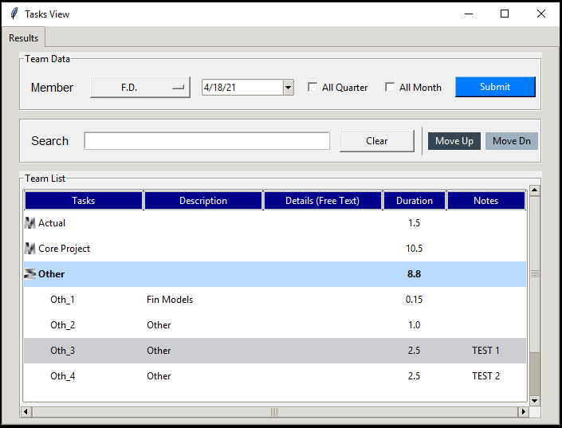
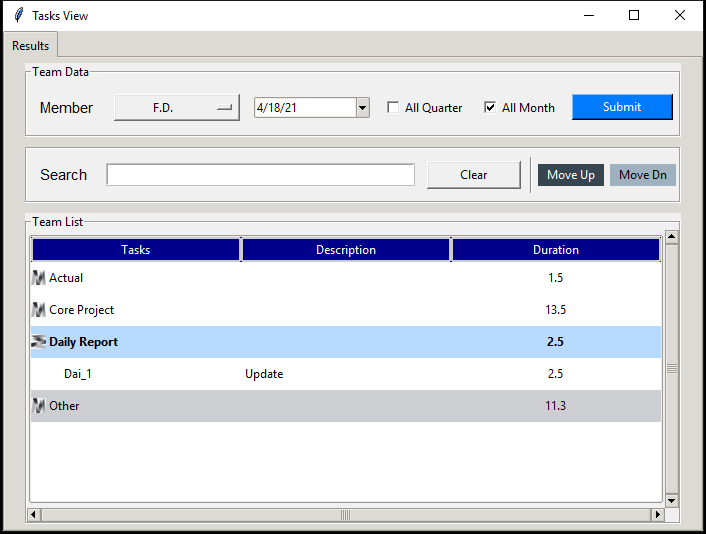

# Tkinter Tasks_View Desktop GUI

## Tasks Daily Calendar View when selecting a date (default date of today)

## Task Quarterly or Monthly Calendar View when either check buttons are checked. Below an img of the monthly view, same view applies for the quarterly view.

### For deployment, to create an executable, please refer to the readme section of Brad Traversy's demonstration [part_manager](https://github.com/bradtraversy/part_manager)